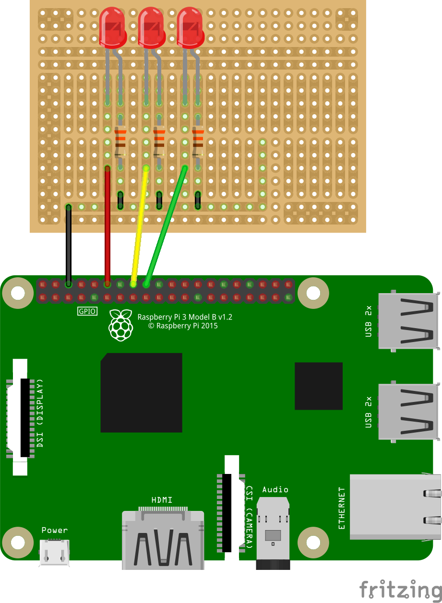

# Raspberry-Pi based VSTS Status light
## Introduction
This script will allow you to monitor your buildstatus with a Raspberry PI. It is inspired by the Jenkins PI-light that appeared in the MagPI Projects Book Volume 3.

It is designed to work with the same hardware setup as described there, although a simple variant for testing purposes is outlined under the Hardware section.

This script is still very much a work in progress. New features will be added over time. If you feel a feature is missing, please submit a feature request.

## The status light
This script will simply light up a LED light depending on the status of your build. Currently, it has the following indicators:
- Solid green: The build has completed successfully
- Blinking yellow: The build is currently running
- Solid red: The build has failed

## Hardware
### Required components
- 1 red LED
- 1 yellow / orange LED
- 1 green LED
- 3 330 ohm resistors
- jumper cables (male-to-male and male-to-female if working with a breadboard)
- A breadboard, proto-HAT or similar

### Assembly


## Installation
- Install the VSTS Python API
    ```sh
    sudo pip install vsts
    ```
- Clone this project
    ```sh
    git clone https://github.com/sourcefile/VSTS-BuildStatus.git
    ```
- Set the correct values in config.py
    - vstsurl: The url to your instance of VSTS
    - vstspat: Your Personal Access Token that can be used to query VSTS.
    - vstsprojectname: The project name inside VSTS
    - vstsbuilddefinition: The id of the build definition you want to monitor
    - gpios: the pins to which the leds are connected. Only change these if your hardware setup differs from the description under Hardware
- Start the script
    ```sh
    python /path/to/script/buildstatus.py
    ```

## Configure the script to run on PI boot
- edit the rc.local file `sudo nano /etc/rc.local`
- add the following line:
    ```
    python /path/to/script/buildstatus.py &
    ```