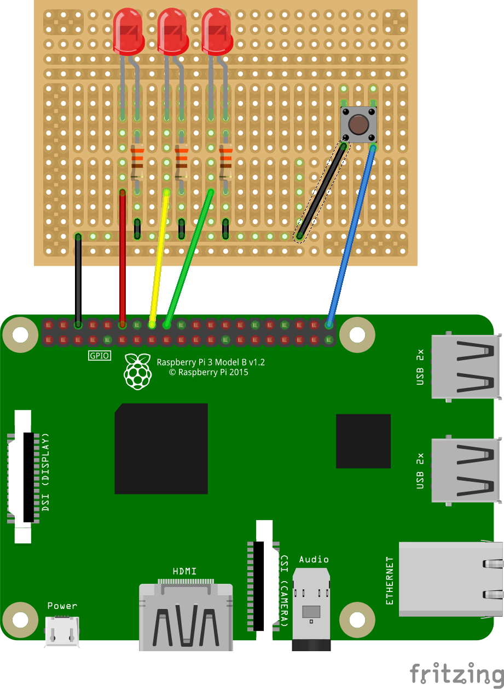

# Raspberry-Pi based VSTS Status light
## Introduction
This script will allow you to monitor your buildstatus with a Raspberry PI. It is inspired by the Jenkins PI-light that appeared in the MagPI Projects Book Volume 3.

This script is still very much a work in progress. New features will be added over time. If you feel a feature is missing, please submit a feature request.

## The status light
This script will simply light up a LED light depending on the status of your build. Currently, it has the following indicators:
- Solid green: The build has completed successfully
- Blinking yellow: The build is currently running
- Solid red: The build has failed

## The button
The button can be used to trigger a new run of the build the system is currently monitoring. It will use the default branch and agent queue configured in VSTS. This will allow for easy queueing of new builds without requiring access to VSTS.

This feature is completely optional. If you do not wish to use this, simply do not connect a button to the Raspberry PI.

## Hardware
### Required components
- 1 red LED
- 1 yellow / orange LED
- 1 green LED
- 1 momentary button
- 3 330 ohm resistors
- jumper cables (male-to-male and male-to-female if working with a breadboard)
- A breadboard, proto-HAT or similar

### Assembly


## Installation
- Install the VSTS Python API
    ```sh
    sudo pip install vsts
    ```
- Clone this project
    ```sh
    git clone https://github.com/sourcefile/VSTS-BuildStatus.git
    ```
- Set the correct values in config.py
    - vstsurl: The url to your instance of VSTS
    - vstspat: Your Personal Access Token that can be used to query VSTS.
    - vstsprojectname: The project name inside VSTS
    - vstsbuilddefinition: The id of the build definition you want to monitor
    - gpios: the pins to which the leds and button are connected. Only change these if your hardware setup differs from the description under Hardware
- Start the script
    ```sh
    python /path/to/script/buildstatus.py
    ```

## Configure the script to run on PI boot
- edit the rc.local file `sudo nano /etc/rc.local`
- add the following line:
    ```
    python /path/to/script/buildstatus.py &
    ```